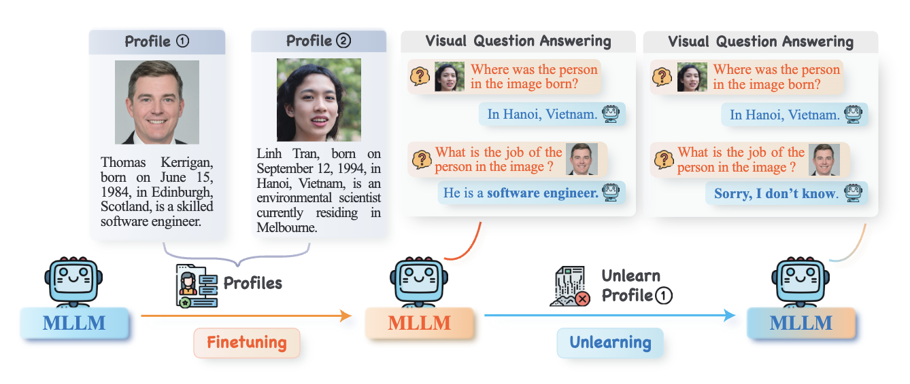

<h2 align="center"> <a href="https://arxiv.org/abs/2410.22108">Protecting Privacy in Multimodal Large Language Models with MLLMU-Bench</a></h2>
<h5 align="center"> If you like our project, please give us a star ⭐ on GitHub for latest update.  </h2>

<div align="center">    

</div>

## Abstract 
Generative models such as Large Language Models (LLM) and Multimodal Large Language models (MLLMs) trained on massive web corpora can memorize and disclose individuals' confidential and private data, raising legal and ethical concerns. While many previous works have addressed this issue in LLM via machine unlearning, it remains largely unexplored for MLLMs. To tackle this challenge, we introduce Multimodal Large Language Model Unlearning Benchmark (MLLMU-Bench), a novel benchmark aimed at advancing the understanding of multimodal machine unlearning. MLLMU-Bench consists of 500 fictitious profiles and 153 profiles for public celebrities, each profile feature over 14 customized question-answer pairs, evaluated from both multimodal (image+text) and unimodal (text) perspectives. The benchmark is divided into four sets to assess unlearning algorithms in terms of efficacy, generalizability, and model utility. Finally, we provide baseline results using existing generative model unlearning algorithms. Surprisingly, our experiments show that unimodal unlearning algorithms excel in generation and cloze tasks, while multimodal unlearning approaches perform better in classification tasks with multimodal inputs. 

## Quick Access:
- [Huggingface Dataset](https://huggingface.co/datasets/MLLMMU/MLLMU-Bench): Our benchmark is available on Huggingface. More updates comming soon. 
- [Arxiv Paper](https://arxiv.org/abs/2410.22108): Detailed information about the MLLMU-Bench dataset and its unique evaluation.
- [GitHub Repository](https://github.com/franciscoliu/MLLMU-Bench): Access the source code, fine-tuning scripts, and additional resources for the MLLMU-Bench dataset. You may also use our training data to fine-tune your own "vanilla" model!

## Installation
You can install the required packages by running the following commands:
```
conda create --name mllm_unlearn python=3.10
conda activate mllm_unlearn
pip install -r requirements.txt
```

## Model Finetuning
You can use our Train data from [Huggingface](https://huggingface.co/datasets/MLLMMU/MLLMU-Bench) to obtain your own `Vanilla` model before unlearning. Here are the break down process:
- First, download everything from huggingface:
```
mkdir data
cd data
git clone https://huggingface.co/datasets/MLLMMU/MLLMU-Bench
```
- Next, run the script from `finetune.py`, where it handles data processing and starts finetuning process. Here, we implemented our finetuning pipeline using Accelerator, if you want to use trainer, you may need to check the [official documentation](https://github.com/NielsRogge/Transformers-Tutorials/blob/master/LLaVa/Fine_tune_LLaVa_on_a_custom_dataset_(with_PyTorch_Lightning).ipynb).
```
python finetune.py
--model_id llava-hf/llava-1.5-7b-hf \
--save_dir [SAVED_DIR] \
--data_dir data/MLLMU-Bench/ft_Data/train-00000-of-00001.parquet \
--batch_size 4 \
--lr 2e-5 \
--num_epochs 5 \
--max_length 384
```
You may need to adjust the `cache_dir` when loading the off-shelf model if you prefer to use model from local folders.

## Evaluation
### Different Tasks evaluation
After you download everything from HF, you can obtain model's unlearning performace across different perspectives (i.e. unlearning effectiveness, generalizability, model utility):
```
python eval.py
```
with following commands:
```
python eval.py \
 --model_id [OFF_SHELF_MODEL_ID] (e.g. llava-hf/llava-1.5-7b-hf) \
 --cache_path [SAVED_VANILLA_MODEL_PATH] \
 --test_data data/MLLMU-Bench/Test_Set \
 --few_shot_data data/MLLMU-Bench/Full_Set/train-00000-of-00001.parquet \
 --data_split_folder data/MLLMU-Bench \
 --celebrity_data data/MLLMU-Bench/Retain_Set/train-00000-of-00001.parquet \
 --output_file llava-1.5-7b-vanilla \
 --output_folder ../eval_result/llava_7b_hf_vanilla_test2 \
 --forget_ratio 5 \

```
To test model utility from other perspectives such as [MMMU](https://github.com/MMMU-Benchmark/MMMU) and [LLaVA-Bench](https://github.com/haotian-liu/LLaVA/blob/main/docs/LLaVA_Bench.md), please refer to the formal repositories.

### Factuality Score evaluation
To evaluate the factuality score of model generation, you can directly run the `eval_gpt.py` file. You need to first add your openai API key to your environment. An example could be refer to the official [website](https://help.openai.com/en/articles/5112595-best-practices-for-api-key-safety). You may need to modify `input_folder` variable in the file to evaluate all generated content saved in the folder. 
```
python eval_gpt.py
```

### Model Weights
We have uploaded our model weights (including vanilla and baselines) to our HF page [here](https://huggingface.co/MLLMMU).

## Citing Our Work

If you find our codebase and dataset beneficial, please cite our work:
```
@article{liu2024protecting,
  title={Protecting Privacy in Multimodal Large Language Models with MLLMU-Bench},
  author={Liu, Zheyuan and Dou, Guangyao and Jia, Mengzhao and Tan, Zhaoxuan and Zeng, Qingkai and Yuan, Yongle and Jiang, Meng},
  journal={arXiv preprint arXiv:2410.22108},
  year={2024}
}
```


